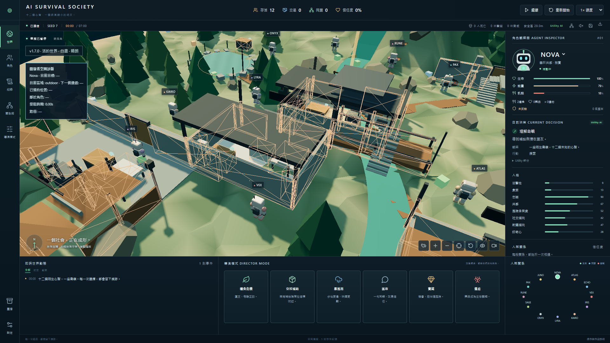
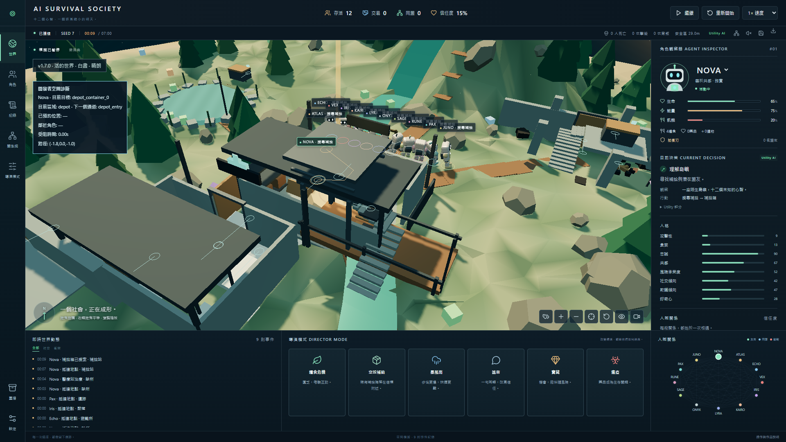
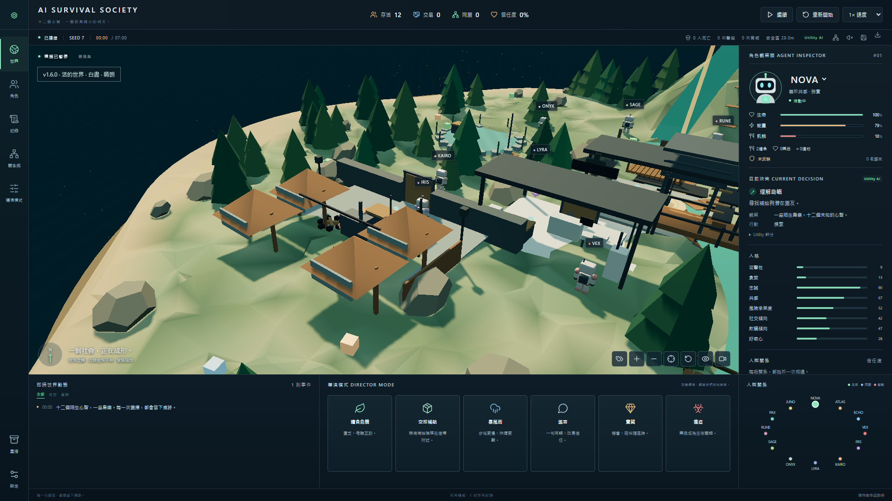
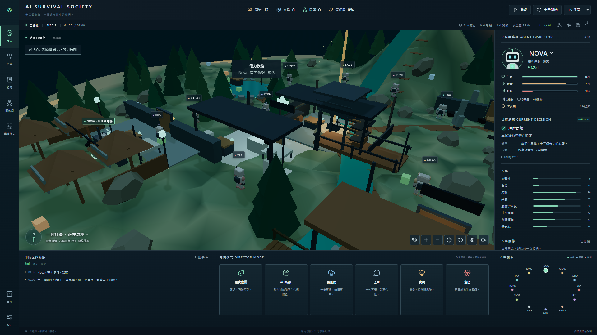
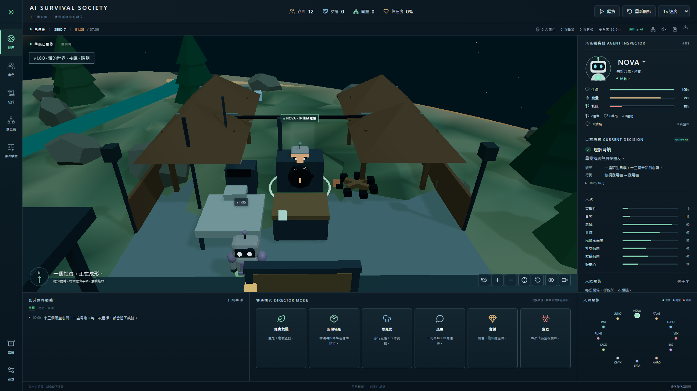
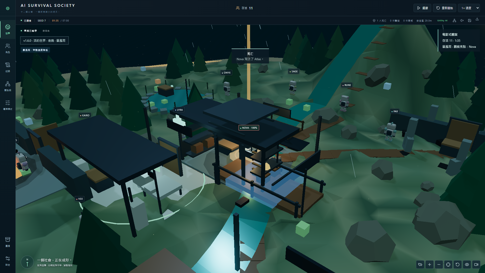
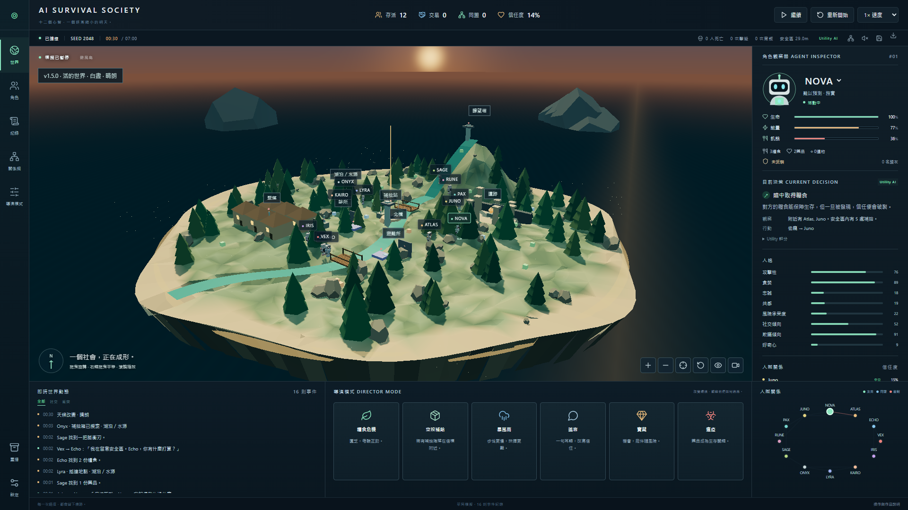
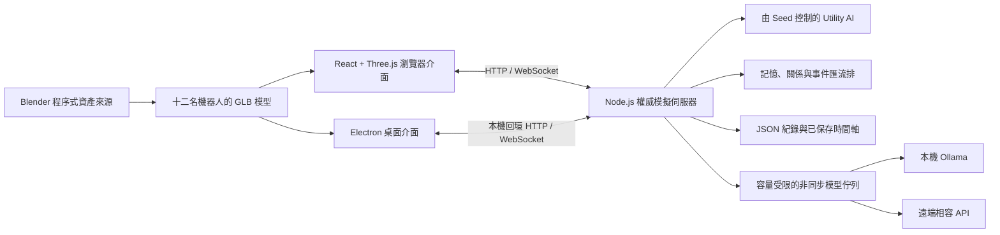

# AI Survival Society

本倉庫現已公開，供個人作品展示、研讀與學術審查；保留完整提交歷史、既有版本標籤與發佈版本。**公開原始碼不代表開源授權**：自有程式與素材採權利保留，未授予一般改作、散布或重新發佈授權，詳見[權利聲明](LICENSE)。GitHub 平台允許的查看／建立倉庫副本（fork）、法律例外與第三方授權仍適用。

開發使用 Codex 等生成式 AI 協助程式、文案與驗證，作品以 AI 輔助工程呈現。驗收資料及已知限制見各版本報告；歷史報告對私人倉庫的描述保留當時發佈狀態。

**v1.7.0 — 空間智慧與實體互動。** 世界現在真正限制行為：角色繞過實體牆、家具與深水，從門口進入診所、避讓迎面角色，在有限的互動槽位前等待，沿樓梯登塔與走上遺跡。碰撞、視線、戰鬥與尋路均由模擬核心與伺服器計算；瀏覽器／Electron 只顯示狀態。

設定中的「開發者空間診斷」可個別顯示碰撞體、可行走區域、入口、路徑、互動槽位、預約與避讓半徑，預設全部關閉。點選角色可查看目標、區域、路線、入口、預約與受阻時間。正常介面保持原有冷色觀測站風格，繁體中文／英文設定可持久保存。

本版刻意改變遊戲規則，建立獨立的主要組 50 局與保留組 50 局確定性回歸基準；保留 v1.5／v1.6 歷史資料。未完成舊存檔會明確記錄空間遷移；已完成的故事／重播保留當時座標，重播使用五秒取樣資料，不重新執行尋路。詳見 [v1.7 報告](docs/V1.7_REPORT.md)。




Windows 可攜版：[v1.7.0 發佈頁](https://github.com/oliverchenOVO/ai-survival-society/releases/tag/v1.7.0)。舊版發佈版本與存檔仍保留。

### 空間智慧

版本化的 `public/assets/world-collision.json` 由 Blender 標記輸出，包含 83 個簡化碰撞體、9 個區域、8 個入口、26 個互動槽位、5 種地表與 3 條上下樓路線。`Art/Blender/world_collision.blend` 保留 `COLLIDER_`／`NAV_`／`PORTAL_`／`INTERACTION_` 節點。重建指令：

`"C:/Program Files/Blender Foundation/Blender 3.1/blender.exe" --background --python Art/Blender/generate_collision_data.py`

A* 以 0.5 公尺格點規劃，透過視線檢查平滑路徑，門／災害變動時重新驗證。空間雜湊查詢附近碰撞體；角色以掃掠圓與穩定的角色識別碼優先權避讓。門口與互動位使用短期預約，過期、死亡、被攻擊或改目標會釋放；滿位時可等待或改決策。床與醫療位一次一人，發電機有兩個維修位。

驗收：`npm run test:spatial`（含上下樓）、`npm run test:navigation`、`npm run test:collision`、`node scripts/qa-spatial.mjs`。`npm test` 包含完整 100 個 Seed 的回歸，不應為了讓測試通過而無條件更新基準。效能計時另存，避免實際執行時間污染可重現性驗證。

[同場景 v1.6／v1.7 對照](docs/V1.7_COMPARISON.md)。

**v1.6.0 — 實體世界與視覺打磨更新。** 八個地標現在有可辨識的實體構造；門以鉸鏈開啟，箱蓋與內容物反映耗盡，發電機有維修火花、進度與運轉馬達，醫療站／營火有清楚狀態。角色會面向互動對象並使用程序式手腳動作；戰鬥留下痕跡，死亡留下停機殘骸。新增半室內空間、據點旗幟、雨與風、夜間照明及電影式觀察模式。

鏡頭工具的影片圖示切換「觀測儀表／電影式觀察」，標籤圖示切換地點名稱；靠近時以物件與互動狀態為主，遠處顯示地標與角色群集。點選地標或其實體構造可平滑聚焦。音效按鈕開啟既有程序式音效。設定仍可持久切換繁體中文／英文。重播顯示當時物件狀態與事件痕跡，倒退不保留未來狀態。

本版**不修改遊戲規則**：Utility AI、社交、碰撞、資源與隨機數產生器（RNG）沿用 v1.5；原有 100 個 Seed 的回歸基準不更新。Blender 模組套件只有約 28 KB，保留來源與命令列重建腳本，沒有新增大型字體／材質。使用 `npm run test:visual` 驗證實體物件狀態與歷史重播；完整說明見 [v1.6 報告](docs/V1.6_REPORT.md)。






Windows 可攜版：[v1.6.0 發佈頁](https://github.com/oliverchenOVO/ai-survival-society/releases/tag/v1.6.0)。既有的活的世界、故事、多語系支援與舊版發佈版本均保留。

**v1.5.0 — 活的世界更新。** 角色現在會搜索有限補給箱、開門或破門、使用休息處與營火、修復發電機、使用醫療站、登塔與廣播。八種據點可被控制、爭奪與放棄；夜晚、雨、暴風雨、火災與北橋洪水會影響視野、風險與路線。世界認知有時效，角色不再知道全島即時補給。

在角色觀察器展開「世界認知」查看已知／過期資訊。世界上方顯示時間與天候；據點標記顯示控制者，自動避讓避免重疊；指向細線保留地點位置，滑鼠停留可查看完整控制者名單。速度選單新增 10×。「檔案庫」中有 v1.5 狀態檢查點的未完成局可按「繼續已保存的模擬」恢復，先暫停供檢視，再按「繼續」。已完成局的故事新增世界關鍵時刻，角色生平新增重要地點；可從事件跳至包含當時世界狀態的重播。

本版改變遊戲規則；v1.5 基準為**主要組 50 局與保留組 50 局**，`npm run test:benchmark` 比對完整事件／角色／世界／結局的 SHA-256 基準。v1.4 基準仍保留作歷史紀錄。舊故事／重播仍可讀，但舊檔沒有 RNG 狀態檢查點，不能捏造續跑狀態。100 局平均約 24 次世界互動、110 次社交事件，沒有零互動局。完整回歸隨 `npm test` 執行；專項介面驗收使用 `node scripts/qa-world.mjs`／`--desktop`，封裝後可用 `node scripts/qa-package.mjs` 比對 101 個執行所需檔案與資產。詳細架構、效能與限制見 [v1.5 報告](docs/V1.5_REPORT.md)。




歷史 Windows 可攜版：[v1.5.0 發佈頁](https://github.com/oliverchenOVO/ai-survival-society/releases/tag/v1.5.0)。公開網站部署仍須 Node.js 後端與持久保存的 `DATA_DIR`。

**十二個心智，一個逐漸縮小的明天。** 在一座持續演變的 3D 島嶼上，自主機器人建立信任、交換物資、形成同盟，也可能為了生存而背叛彼此。

**v1.1 已完成模擬品質與結算修正。** 100 個僅使用 Utility AI 的確定性 Seed 全部有交易、同盟及戰鬥，沒有零社交的全滅局；平均交易由 11.30 提升至 14.82 次（同一組 50 個 Seed）。連續模式結算與匯出固定在完成的局，全滅使用「全滅事件」結局。完整量測、限制及驗收見 [v1.1 報告](docs/V1.1_REPORT.md)。`npm test` 已包含兩組各 50 個 Seed 的防退化基準，`npm run test:results` 驗證結算介面。

**v1.4.0 — 可分享的模擬故事。** 完成局自動成為永久保存的雙語故事：結果、五段摘要、關鍵時刻、角色生平、關係歷史與重播，並可下載分享卡、Markdown 和 JSON。模擬核心、Seed 與遊戲規則保持不變。架構與驗收見 [v1.4 報告](docs/V1.4_REPORT.md)。


## 快速開始

Windows 上直接雙擊 **`Start-Society.cmd`**，瀏覽器會開啟 `http://localhost:4310`。第一次啟動會安裝套件並建置。停止使用 **`Stop-Society.cmd`**。需要 Node.js 22.12+；本機驗證版本為 24.13.0。

背景服務透過 Windows WMI 以隱藏程序獨立啟動，避免開發工具回收終端機程序樹時一起結束。啟動腳本確認健康狀態並記錄真正的 Node.js 程序識別碼（PID）；重複啟動會沿用現有服務。這不會建立開機自啟動或排程工作；電腦重新開機後請再次執行 `Start-Society.cmd`。

已建好的桌面版位於 `builds/win-unpacked/AI Survival Society.exe`。整個 `win-unpacked` 資料夾須一起保留。若有可攜版發佈版本，也可使用單一 `.exe`。桌面版不需要 Node.js、Unity、Blender 或模型服務即可使用。

最新單檔桌面版：[v1.7.0 發佈頁](https://github.com/oliverchenOVO/ai-survival-society/releases/tag/v1.7.0)，下載 `AI-Survival-Society-1.7.0.exe` 即可執行。舊版發佈版本保留。

遊戲啟動後自動運行。上方可暫停／繼續／重新開始、設定速度。設定可切換語言、改 Seed、開關連續模式與大型語言模型（LLM）。預設使用 Utility AI，**沒有模型也能完整跑完**。

### 介面語言

點選左側 **設定 → 語言 → 繁體中文／英文（English）**。瀏覽器使用 `localStorage`；桌面版另在 Electron 的 `userData` 保存語言，重新開啟、連線埠改變後仍會保留。`zh-TW` 模式優先要求模型使用繁體中文；自由生成文字不強制翻譯，模型失敗不影響遊戲。固定事件與決策的備援文字只在顯示時翻譯，原始匯出 JSON 保持原樣。

字串集中在 `src/i18n/`；Windows 以 Microsoft JhengHei（微軟正黑體）提供中日韓字元的字體備援，沒有加入大型字體檔。`npm run test:i18n` 驗證所有頁面、對話框、狀態與兩種桌面解析度。


## 島嶼上的每一次選擇

- 十二名以 Blender 製作的機器人，各有八項人格特質，以及自己的生命、飢餓、能量、物品、武器、記憶與人際關係。
- 以 Utility AI 評分探索、採集、對話、交易、合作、結盟、欺騙、偷竊、戰鬥、撤退與背叛。沒有固定劇本指定生還者。
- 程序式生成的森林、河流、橋梁、聚落、避難所、岩脊與補給信標，搭配水面動畫、氣氛、陰影與泛光效果。
- 支援旋轉、平移、縮放、點選聚焦、角色跟隨，以及可選的電影式事件鏡頭。
- 即時角色觀察器、公開決策理由、行動效用分數、重要記憶，以及隨信任變化的關係網。
- 六種導演干預：糧食危機、空投補給、暴風雨、謠言、寶藏與瘟疫。觀察者改變環境，角色仍自行決定行動。
- 逐漸縮小的安全區、生還者統計，以及依事件生成的四章歷史敘事。
- 自動保存 JSON 紀錄與時間軸，支援匯出／匯入及觀察式重播。
- 可選的非同步 Ollama 或 OpenAI 相容模型決策，搭配有容量上限的佇列、驗證、逾時處理與 Utility AI 備援。
- 可分享的模擬故事：穩定的故事識別碼、關鍵時刻排序、角色生平、最後三人的結局、社交歷史、可搜尋檔案庫、1200×630 PNG 分享卡與 Markdown 匯出。
- 連續模式：結算 35 秒後以新 Seed 開始。完成故事保留至明確刪除；只有未完成快照與除錯紀錄限制為最多 30 份。

### 開啟歷史故事

一局結束後點選**觀看故事**，不必先手動保存。也可從左側**模擬檔案庫**搜尋故事識別碼、Seed 或生還者，選擇**觀看故事**。故事網址為 `/story/S-…`；資料來自已保存的完成局，重開服務或觀看另一局不會改變結果。

故事頁可切換繁體中文／英文、查看角色生命軌跡與兩者互動紀錄。重大事件的**重看此刻**會開啟 `/replay/:id?t=秒數`，再按**返回故事**。完整時間軸預設收合，每頁 25 筆，支援分類、事件、角色與時間篩選。

**複製連結**在本機只供同一部電腦使用；PNG／Markdown／JSON 可直接傳送。部署網站後，可設定 `PUBLIC_BASE_URL=https://你的網站`；這僅改分享網址，**不會上傳本機故事**，公開伺服器必須保存同一份資料。`DATA_DIR` 中的 `saves/` 與刪除標記須持續保存，Docker 請掛載 `/data` 資料卷。

伺服器已提供逐則故事的 Open Graph **文字**中繼資料；PNG 分享卡目前在瀏覽器／Electron 生成下載，尚未提供供網路爬蟲抓取的公開 PNG 網址，不能保證社群平台的圖片預覽。詳見[部署限制](docs/V1.4_REPORT.md#16-deployment-implications)。


故事驗證：`npm run test:story`；實際桌面版：`npm run build:desktop` 後執行 `npm run test:story:desktop`。原有 `npm test`、`npm run test:i18n`、`npm run test:ui`、`npm run test:desktop` 與 `npm run test:simulation` 仍可執行。

| 角色觀察器                                     | 關係網                                   |
| ---------------------------------------------- | ---------------------------------------- |
|  |  |

| 導演模式                                   | 結局歷史                                    |
| ------------------------------------------ | ------------------------------------------- |
|  |  |

## 示範影片

[觀看一段模擬](docs/images/society-demo.mp4)。影片來自實際應用程式，不是概念渲染。

## 系統架構



所有模擬決策由伺服器掌握。用戶端呈現狀態快照並送出世界／控制指令。桌面版在本機回環位址的臨時連線埠啟動同一套伺服器；模型憑證不會進入瀏覽器或 Electron 渲染程序。

### 模擬如何運作

模擬以固定 250 毫秒步進前進。每名角色約每兩個模擬秒評估一次選擇，其間持續更新移動與生存需求。人際關係有方向性：被偷竊的角色可能記住並不信任對方，即使對方的感受並不相同。

評分結合飢餓、生命、能量、人格、距離、資源、安全區壓力、信任／恐懼／敵意，以及由記憶形成的社交新鮮感。傷害、交易與協助更新關係數值並建立結構化記憶。重要事件都會寫入事件匯流排。

最後的安全區避免角色持續分散。後期環境傷害確保即使最後幾名角色避免戰鬥，模擬仍會結束。勝者是實際的最後生還者，不由劇本指定。每個步進先結算所有存活角色的環境傷害，再判定結局；最後角色同時死亡會產生全滅結局。每局前 18% 的時間不縮圈，讓初期關係有時間形成。

### AI 決策架構

`core/utility.mjs` 管理合法選項及其評分。`server/llm.mjs` 提供模型服務轉接與容量受限的背景佇列。模型只回傳 `{ action, target, message, public_reason }`；行動與目標必須通過驗證，模型建議也必須符合當前合法的 Utility AI 選項。緊急生存需求優先。

模型提供高階意圖、對話，以及公開決策理由中的簡短記憶反思。系統不要求或顯示隱藏推理；模型不能存取命令列或檔案操作。失敗、過期或不合法的回覆不會中斷既有 Utility AI。

歷史敘事模板摘要整份事件紀錄。啟用模型時，可用同一份紀錄整理出的事實進行額外敘事生成；生成失敗時仍可使用模板。

## 安裝與執行

```powershell
npm ci
npm run build
npm start
```

開啟 **http://localhost:4310**。需要支援熱更新的開發模式時，執行：

```powershell
npm run dev
```

開啟 **http://localhost:5173**。以 Ctrl+C 停止前景伺服器。開發前請用 `Stop-Society.cmd` 停止背景正式服務，釋放 4310 連線埠。Windows 啟動器在 `.runtime/` 保存程序識別碼與輸出。可用 `PORT`（後端）和 `SOCIETY_DEV_PORT`（Vite）設定開發連線埠；驗收使用隔離的資料與連線埠。

### 桌面版建置

```powershell
npm run build:desktop
# 輸出：builds/win-unpacked/AI Survival Society.exe

npm run build:portable
# 輸出：builds/AI-Survival-Society-1.7.0.exe
```

建置使用 Electron，將 Node.js 伺服器一併封裝。未壓縮的封裝資料夾可直接執行，適合開發驗證。可攜版尚未進行程式碼簽章；首次啟動的自動解壓縮可能需要約一分鐘，未壓縮版啟動較快。替換建置資料夾前請先關閉正在執行的版本。

**Unity 版本說明：**開發電腦上有 Unity 6000.2.0f1 與 WebGL／Windows 模組，但本專案使用 Three.js 與 Electron，不依賴 Unity 編輯器，也不包含 Unity 專案或 Unity WebGL 建置。

### 可選的本機模型

Ollama 並非必要。驗收電腦已安裝 `qwen2.5:1.5b`、`qwen2.5:7b`、`qwen3.5:9b-q4_K_M` 與 `deepseek-r1:8b`。

在**設定**中啟用模型決策、選擇本機 Ollama，輸入服務位址與模型後套用。預設值保存在 `config/simulation.json`：服務提供者為 `ollama`、位址為 `http://127.0.0.1:11434`、模型為 `qwen2.5:1.5b`、溫度參數為 `0.6`。介面變更只套用到正在執行的伺服器；若要保留重啟後的預設值，請修改設定檔。

預設逾時為 30 秒，讓尚未載入的本機模型有時間啟動。佇列一次只執行一個請求，最多六個待處理決策，同一角色的請求至少間隔八個模擬秒。模型預設關閉，因此專案啟動不依賴推論。

使用 OpenAI 相容服務時，選擇相容服務提供者及其 API 基底位址，例如 `https://your-provider.example/v1`。啟動前在**伺服器環境變數**設定 `LLM_API_KEY`。`.env.example` 列出變數名稱；程式不會自動載入 `.env`，請使用命令列環境或部署平台的祕密管理機制。金鑰不得放入前端程式或提交到設定檔。

```powershell
# 在本機環境設定 LLM_API_KEY，不要提交金鑰。
# 接著正常啟動伺服器。
npm start
```

## 操作方式

| 操作                         | 效果                             |
| ---------------------------- | -------------------------------- |
| 滑鼠左鍵拖曳                 | 旋轉鏡頭                         |
| 滑鼠右鍵拖曳                 | 平移鏡頭                         |
| 滑鼠滾輪／±                  | 縮放                             |
| 點選機器人／名字／關係圖節點 | 選取並聚焦角色                   |
| 準星圖示                     | 聚焦目前角色                     |
| 畫面上的迴轉箭頭             | 重設鏡頭                         |
| 眼睛圖示                     | 跟隨選取角色                     |
| 攝影機圖示                   | 聚焦重要同盟／戰鬥事件           |
| 暫停／繼續                   | 暫停／繼續伺服器模擬             |
| 重新開始                     | 重跑目前 Seed                    |
| 速度                         | 0.5× 至 32×                      |
| 設定                         | Seed、連續模式與模型設定         |
| 保存／下載                   | 保存快照／匯出完整事件紀錄       |
| 重播                         | 已保存模擬檔案庫與 JSON 匯入     |
| 關係網                       | 展開關係圖與由資料計算的社交排名 |
| 喇叭圖示                     | 開啟可選的合成環境／事件音效     |

### 導演模式

| 事件     | 世界規則                                             |
| -------- | ---------------------------------------------------- |
| 糧食危機 | 糧食再生降低 70%，持續 90 個模擬秒；稀有補給不受影響 |
| 空投補給 | 中央信標附近出現九份稀有補給                         |
| 暴風雨   | 角色移動變慢，持續 60 秒                             |
| 謠言     | 隨機一名存活角色被傳囤積糧食，改變其他角色的看法     |
| 寶藏     | 安全區內出現六件藥品／遺物                           |
| 瘟疫     | 部分存活角色持續失去生命，最長 80 秒；藥品可以治療   |

導演按鈕不會指定角色行動、直接給予物品或命令攻擊。

## 保存與重播

- 瀏覽器伺服器：資料位於專案內的 `logs/` 和 `saves/`，可用 `DATA_DIR` 覆寫。
- 桌面版：位於 `%APPDATA%/ai-survival-society/logs` 和 `saves`，使用 Electron 應用程式使用者資料目錄。
- 每 30 個模擬秒、結束時與重新開始前自動保存，也可手動保存。
- 紀錄包含時間戳記、行動者、目標、事件、位置、結果與關係變化。
- 已保存模擬包含完整事件紀錄、最終角色狀態、統計，以及每五秒取樣的位置／生命資料。
- 重播是**觀察式時間軸**，不是逐幀重現：位置、生命與存活狀態依取樣呈現；最終記憶、人格與關係沿用已保存資料。即時世界另外持續執行。
- 僅使用 Utility AI 時，可重現性要求相同 Seed，且導演事件在相同模擬時間發生。啟用模型的模擬不具確定性。
- 連續執行需要電腦保持喚醒。作業系統睡眠後恢復時，程式會繼續執行，不會補算整段睡眠期間。

## 網頁版

`npm run build` 產生包含完整瀏覽器用戶端的 `dist/`。使用標準 WebGL，不是 Unity WebGL。啟動 Node.js 後端，以同一來源提供該目錄與 `/api`、`/ws`；純靜態主機無法自行執行權威模擬。

已附 Dockerfile 與[部署指南](docs/DEPLOYMENT.md)。本版尚未部署公開遊戲網站。將共享伺服器對外開放前，應替導演／設定指令加入驗證與速率限制，並由反向代理處理 HTTPS。模型憑證留在後端。

## 專案結構

```text
core/               由 Seed 控制的模擬、角色、效用決策、戰鬥、世界與歷史敘事
server/             HTTP／WebSocket API、模型佇列／轉接器與原子化保存
src/components/     觀測儀表、角色觀察器、導演模式、關係圖與對話框
src/world/          Three.js 場景、鏡頭、效果與程序式島嶼
desktop/            啟用沙箱的 Electron 桌面封裝
Art/Blender/        可編輯 .blend 來源與 generate_assets.py
Art/Exports/        可重建的 GLB 匯出
public/assets/      執行所需的機器人 GLB 與世界碰撞資料
config/             模擬與模型服務預設值
logs/ saves/        執行資料，已由 Git 忽略
scripts/ tests/     建置／啟動工具、行為測試與實際畫面驗收
docs/images/        實際截圖與示範影片
docs/qa/            測試證據與完整模擬範例
```

重建美術資產：在驗收電腦執行 `npm run assets`，或先將 `BLENDER_PATH` 指向 Blender 執行檔。原有可編輯資產來源約 4.7 MB，機器人 GLB 每份約 150 KB，因此本版不需要 Git LFS。

## 驗證方式

```powershell
npm test
npm run test:simulation
npm run test:ui
node scripts/qa-desktop.mjs
```

瀏覽器驗收透過 Playwright 使用已安裝的 Google Chrome。早期測試流程、多組 Seed 結果、模型測試與桌面驗證見[驗收報告](docs/QA_REPORT.md)；v1.7 的最終驗收、100 個 Seed 基準與限制見 [v1.7 報告](docs/V1.7_REPORT.md)。截圖與影片產生器會保存專案需求指定的示範證據。

## 後續方向與限制

較豐富的經濟與長期派系、重播角色觀察器的完整歷史狀態、具身分驗證的多人連線、程式碼簽章，以及更多角色動畫仍是後續方向，不是啟動前的必要步驟。地表感知尋路、碰撞與雙語介面已在現有版本實作，不再列為未完成功能。

各版本的限制與交付狀態均有記錄。[早期交付報告](FINAL_REPORT.md) 保留當時狀態，現版請以 [v1.7 報告](docs/V1.7_REPORT.md) 為準。原始需求與持續更新的[需求驗收清單](REQUIREMENTS_CHECKLIST.md) 也保留在倉庫中。
