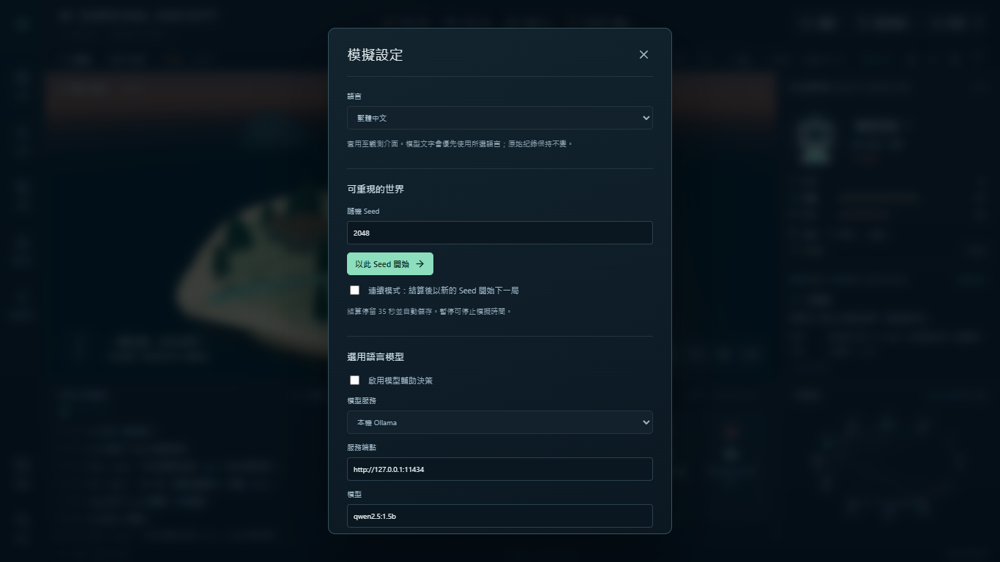
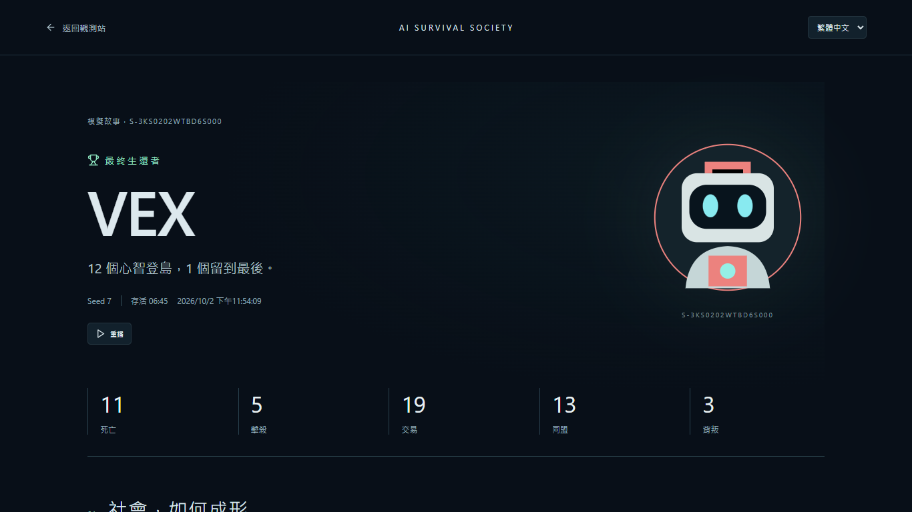
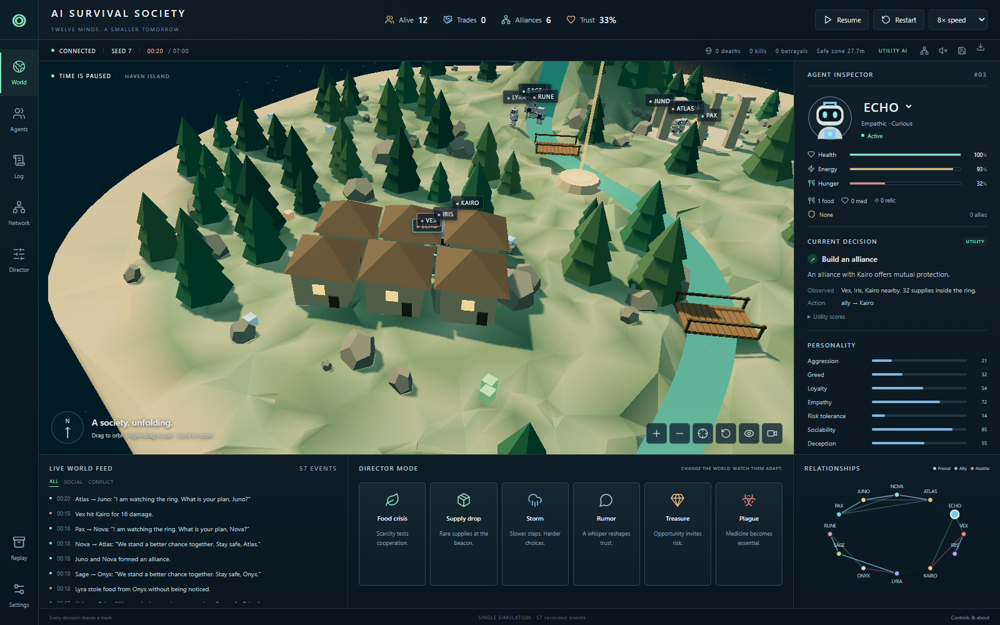
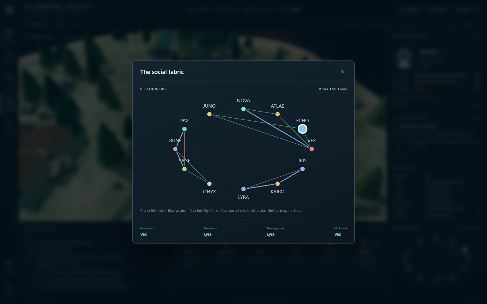
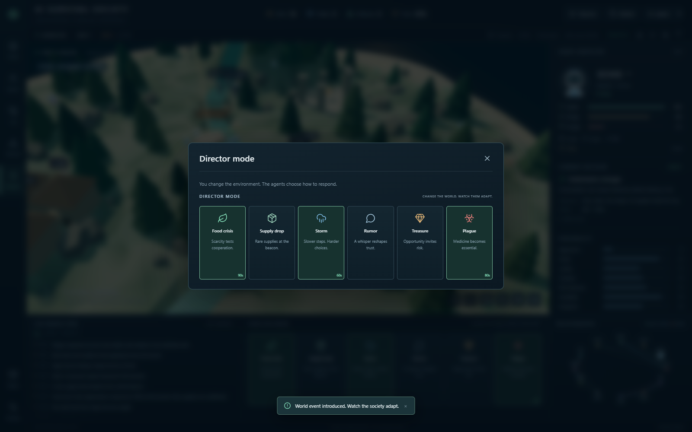
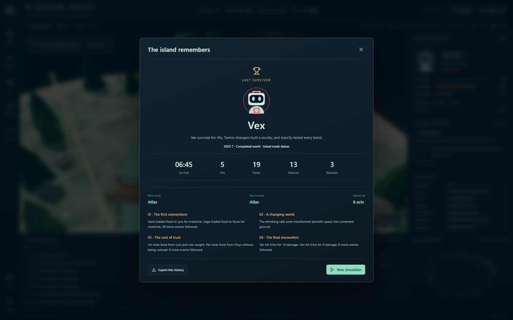
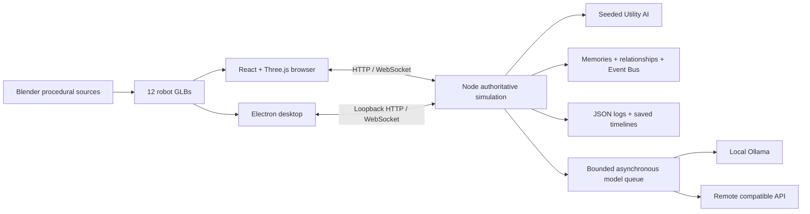

# AI Survival Society

**Twelve minds. A smaller tomorrow.** A living 3D island where autonomous robots build trust, exchange supplies, form alliances and sometimes betray each other to survive.

**v1.1 已完成模擬品質與結算修正。** 100個 utility-only deterministic seeds 全部有交易、聯盟及戰鬥，無零社交全滅；平均交易由11.30提升至14.82次（同一50-seed cohort）。連續模式結算與匯出固定在完成的局，全滅使用EXTINCTION EVENT。完整量測、限制及驗收見 [v1.1 report](docs/V1.1_REPORT.md)。`npm test` 已包含兩組50-seed防退化基準，`npm run test:results`驗證結算UI。

**v1.4.0 — Shareable Simulation Stories。** 完成局自動成為永久保存的雙語故事：結果、五段摘要、關鍵時刻、角色生平、關係歷史與重播，並可下載分享卡、Markdown 和 JSON。模擬核心、Seed 與 gameplay 保持不變。架構與驗收見 [v1.4 報告](docs/V1.4_REPORT.md)。


## 快速開始

Windows 上直接雙擊 **`Start-Society.cmd`**，瀏覽器會開啟 `http://127.0.0.1:4310`。第一次啟動會安裝套件並建置。停止使用 **`Stop-Society.cmd`**。需要 Node.js 22.12+；本機驗證版本為 24.13.0。

背景服務透過 Windows WMI 以隱藏程序獨立啟動，避免開發工具回收終端機程序樹時一起結束。啟動腳本確認健康狀態並記錄真正的 Node PID；重複啟動會沿用現有服務。這不會建立開機自啟動或排程工作；電腦重新開機後請再次執行 `Start-Society.cmd`。

已建好的桌面版位於 `builds/win-unpacked/AI Survival Society.exe`。整個 `win-unpacked` 資料夾須一起保留。若有 portable release，也可使用單一 `.exe`。桌面版不需要 Node、Unity、Blender 或模型服務即可使用。

最新單檔桌面版：[私人 Release v1.4.0](https://github.com/oliverchenOVO/ai-survival-society/releases/tag/v1.4.0)，下載 `AI-Survival-Society-1.4.0.exe` 即可執行。舊版 Release 保留。

遊戲啟動後自動運行。上方可暫停／繼續／重新開始、設定速度。設定可切換語言、改 Seed、開關連續模式與 LLM。預設使用 Utility AI，**沒有模型也能完整跑完**。

### 介面語言

點選左側 **設定 → 語言 → 繁體中文 / English**。Browser 使用 localStorage；桌面版另在 Electron userData 保存語言，重新開啟、連線埠改變後仍會保留。zh-TW 模式優先要求模型使用繁體中文；自由生成文字不強制翻譯，模型失敗不影響遊戲。固定事件與決策 fallback 只在顯示時翻譯，原始匯出 JSON 保持原樣。

字串集中在 `src/i18n/`；Windows 以 Microsoft JhengHei 提供 CJK fallback，沒有加入大型字體檔。`npm run test:i18n` 驗證所有頁面、modal、狀態與兩種桌面解析度。



## What unfolds on the island

- Twelve Blender-authored robots, with eight personality traits and their own health, hunger, energy, inventory, weapons, memories and relationships.
- Utility-scored exploration, foraging, dialogue, trade, cooperation, alliance, deception, theft, combat, retreat and betrayal. No fixed storyline chooses the winner.
- A procedural forest, river, bridges, village, sanctuary, rocky ridge and supply beacon, with animated water, atmosphere, shadows and bloom.
- Orbit, pan, zoom, click-to-focus, agent follow and an optional cinematic event camera.
- Live agent inspector, public decision reasons, utility scores, important memories and a social network that changes as trust changes.
- Six Director interventions: food crisis, supply drop, storm, rumor, treasure and plague. You change the environment; the agents retain control of their actions.
- Shrinking safety zone, winner statistics and an event-derived four-chapter historian.
- Automatic JSON logs, saved timelines, export/import and observational replay.
- Optional asynchronous Ollama or OpenAI-compatible model decisions, with bounded queues, validation, timeouts and Utility AI fallback.
- Shareable Simulation Stories: stable Story IDs, ranked moments, cast biographies, final-three endings, social history, searchable library, 1200×630 PNG cards and Markdown exports.
- Continuous mode: a new seed begins 35 seconds after the result. Completed stories remain until explicitly deleted; only unfinished snapshots and debug logs are capped at 30.

### 開啟歷史故事

一局結束後點 **觀看故事**，不必先手動 Save。也可從左側 **模擬檔案庫** 搜尋 Story ID、Seed 或生還者，選擇 **觀看故事**。故事網址為 `/story/S-…`；資料来自已保存的完成局，重開服務或觀看另一局不會改變結果。

故事頁可切換繁體中文／English、查看角色生命軌跡與兩者互動紀錄。重大事件的 **重看此刻** 會開啟 `/replay/:id?t=秒數`，再按 **返回故事**。完整時間軸預設收合，每頁 25 筆，支援分類、事件、角色與時間篩選。

**複製連結** 在本機只供同一部電腦使用；PNG／Markdown／JSON 可直接傳送。部署網站後，可設定 `PUBLIC_BASE_URL=https://你的網站`；這僅改分享網址，**不會上傳本機故事**，公開伺服器必須保存同一份資料。`DATA_DIR` 中的 `saves/` 與刪除標記須持續保存，Docker 請掛載 `/data` volume。

Server 已提供逐則故事的 Open Graph **文字** metadata；PNG 分享卡目前在 Browser／Electron 生成下載，尚未提供供 crawler 抓取的公開 PNG URL，不能保證社群平台的圖片預覽。詳見 [部署限制](docs/V1.4_REPORT.md#16-deployment-implications)。



故事驗證：`npm run test:story`；實際桌面版：`npm run build:desktop` 後執行 `npm run test:story:desktop`。原有 `npm test`、`test:i18n`、`test:ui`、`test:desktop` 與 `test:simulation` 仍可執行。

| Agent inspector | Social network |
|---|---|
|  |  |

| Director mode | Final history |
|---|---|
|  |  |

## Demo video

[Watch a short simulation](docs/images/society-demo.mp4). The video shows the actual application, not a rendered concept.

## Architecture



The server owns all simulation decisions. The client renders snapshots and sends world/control commands. The desktop app starts the same server on a private ephemeral loopback port. No model secret enters the browser or Electron renderer.

### How it works

The simulation advances in fixed 250ms steps. Every agent evaluates choices roughly every two simulation seconds. Movement and survival needs advance between choices. Relationships are directional: the victim of a theft can remember and distrust its perpetrator even when the perpetrator feels differently.

Scores combine hunger, health, energy, personality, proximity, resources, safety-zone pressure, relationship trust/fear/hostility and memory-based social novelty. Damage, trades and assistance update relationship values and create structured memories. Important events always enter the Event Bus.

The final zone keeps agents from dispersing forever. Late-round exposure ensures a run terminates even if the final agents avoid combat. The winner is the actual last survivor, not a named character chosen by a script. Environmental damage resolves for all living agents in the tick before deciding the ending; simultaneous final deaths produce extinction. The opening 18% of each match has no zone contraction, allowing initial relationships to develop.

### AI architecture

`core/utility.mjs` owns the legal choices and their scores. `server/llm.mjs` is a provider adapter and a bounded background queue. Models return only `{ action, target, message, public_reason }`. Actions and targets are validated; model suggestions must also match a currently legal Utility choice before use. Urgent survival needs take precedence.

Models supply high-level intent, dialogue and a short memory reflection in the public reason. Hidden reasoning is never requested or shown. Models cannot access shell commands or file operations. A failed, stale or illegal response leaves the existing Utility system running.

Historian templates summarize the entire event log. With the model enabled, grouped facts from that same log are used for optional narrative generation. The template remains available if narration fails.

## Installation and run

```powershell
npm ci
npm run build
npm start
```

Open **http://127.0.0.1:4310**. For development with hot reload:

```powershell
npm run dev
```

Open **http://127.0.0.1:5173**. Stop a foreground server with Ctrl+C. The Windows launcher runs the production server in the background and writes its process ID/output under `.runtime/`.

### Desktop build

```powershell
npm run build:desktop
# Output: builds/win-unpacked/AI Survival Society.exe

npm run build:portable
# Output: builds/AI-Survival-Society-1.4.0.exe
```

The build uses Electron and packages the Node server with the app. The unpacked folder is a valid runnable development distribution. Portable builds are unsigned. Cold self-extraction can take about a minute; the unpacked executable starts faster. Close any running copy before replacing its build folder.

**Unity version:** Unity 6000.2.0f1 and its WebGL/Windows modules were found on the development machine. This project uses Three.js and Electron, so it has no Unity Editor dependency and does not contain a Unity project or Unity WebGL build.

### Optional local model

Ollama is optional. The inspected computer already has `qwen2.5:1.5b`, `qwen2.5:7b`, `qwen3.5:9b-q4_K_M` and `deepseek-r1:8b`.

In **Settings**, enable model decisions, select Local Ollama, enter your endpoint and model, and apply. Defaults are stored in `config/simulation.json`: provider `ollama`, endpoint `http://127.0.0.1:11434`, model `qwen2.5:1.5b`, temperature `0.6`. UI changes apply to the running server; edit the configuration file for defaults that survive server restarts.

The default timeout is 30 seconds to allow a cold local model to load. The queue uses one request at a time, at most six pending decisions and at least eight simulation seconds between requests per agent. Models are disabled by default, so launching the project never depends on inference.

For an OpenAI-compatible service, choose the compatible provider and its API base, for example `https://your-provider.example/v1`. Set `LLM_API_KEY` in the **server environment** before starting it. `.env.example` lists variable names; the app does not automatically load `.env`, so use your shell or deployment secret manager. Never put a key in frontend code or committed configuration.

```powershell
# Set LLM_API_KEY in your local environment without committing it.
# Then start the server normally.
npm start
```

## Controls

| Control | Effect |
|---|---|
| Left drag | Orbit |
| Right drag | Pan |
| Mouse wheel / ± | Zoom |
| Robot/name/graph node | Select and focus agent |
| Crosshair | Focus current agent |
| Circular arrow on viewport | Reset camera |
| Eye | Follow selected agent |
| Video camera | Focus notable alliance/combat events |
| Pause / Resume | Hold/continue authoritative simulation |
| Restart | Repeat current seed |
| Speed | 0.5× through 32× |
| Settings | Seed, continuous mode, model configuration |
| Save / Download | Save snapshot / export complete event log |
| Replay | Saved-run archive and JSON import |
| Network | Expanded graph and data-derived social rankings |
| Speaker | Optional synthesized ambient/event sounds |

### Director mode

| Event | World rule |
|---|---|
| Food crisis | Food regeneration reduced by 70% for 90 simulation seconds; rare supplies are unaffected |
| Supply drop | Nine rare supplies around the central beacon |
| Storm | Slower agent movement for 60 seconds |
| Rumor | A randomly chosen living agent is rumored to be hoarding food; perception changes |
| Treasure | Six medicine/relic items appear within the safe zone |
| Plague | Some living agents lose health for up to 80 seconds; medicine can cure them |

No Director button assigns an action, gives inventory directly or orders an attack.

## Persistence and replay

- Browser server: `logs/` and `saves/` inside the project; override with `DATA_DIR`.
- Desktop: `%APPDATA%/ai-survival-society/logs` and `saves` (Electron application user data).
- Automatic save every 30 simulation seconds, at completion and before restart; explicit Save is also available.
- Logs contain timestamp, actor, target, event, position, result and relationship changes.
- Saved runs contain the full event log, final agent state, statistics and position/health samples every five seconds.
- Replay is an **observational timeline**, not frame-perfect replay: positions, health and alive state follow samples; final memories/personality/relationships remain from the saved run. The live world continues separately.
- Utility-only reproducibility requires the same seed and Director events at the same simulation times. Model-enabled runs are not deterministic.
- Continuous operation requires the computer to stay awake. Resuming from OS sleep resumes the process rather than simulating the entire sleep interval.

## Web version

`npm run build` produces `dist/` with the complete browser client. It uses standard WebGL, not Unity WebGL. Run the Node backend to serve that directory and `/api` + `/ws` from the same origin. A static-only host cannot run the authoritative simulation by itself.

A Dockerfile and deployment guide are included in [docs/DEPLOYMENT.md](docs/DEPLOYMENT.md). No public site is deployed in this release. Before publicly exposing a shared server, add authentication/rate limits for Director/settings commands and terminate HTTPS at your reverse proxy. Keep model credentials on the backend.

## Project structure

```text
core/               Seeded simulation, agents, utility decisions, combat, world, historian
server/             HTTP/WebSocket API, model queue/adapters, atomic persistence
src/components/     Dashboard, inspector, Director, social graph, dialogs
src/world/          Three.js scene, camera, effects, procedural island
desktop/            Sandboxed Electron wrapper
Art/Blender/        Editable .blend source and generate_assets.py
Art/Exports/        Rebuildable GLB exports
public/assets/      Runtime robot GLBs
config/             Simulation and provider defaults
logs/ saves/        Runtime data (ignored by Git)
scripts/ tests/     Build/start utilities, behavioral tests, actual rendered QA
docs/images/        Real screenshots and demonstration video
docs/qa/            Test evidence and example full simulation
```

To rebuild the art: `npm run assets` on the inspected machine, or set `BLENDER_PATH` to your Blender executable first. The editable source is about 4.7MB; GLBs are about 150KB each, so LFS is not required for this release.

## Verification

```powershell
npm test
npm run test:simulation
npm run test:ui
node scripts/qa-desktop.mjs
```

Browser QA uses installed Google Chrome via Playwright. See [docs/QA_REPORT.md](docs/QA_REPORT.md) for the exact tested workflows, multi-seed results, model test and desktop verification. Screenshot and video generators intentionally save demonstration evidence requested by the project brief.

## Future work

Terrain-aware pathfinding and collision; richer economy and longer-term factions; full state checkpoints for replay inspectors; authenticated multi-user sessions; code signing; more character animation; optional bilingual UI. These are extensions, not required setup steps.

The current limitations and delivery status are recorded honestly in [FINAL_REPORT.md](FINAL_REPORT.md). Original requirements and the live acceptance checklist are retained in the repository.
