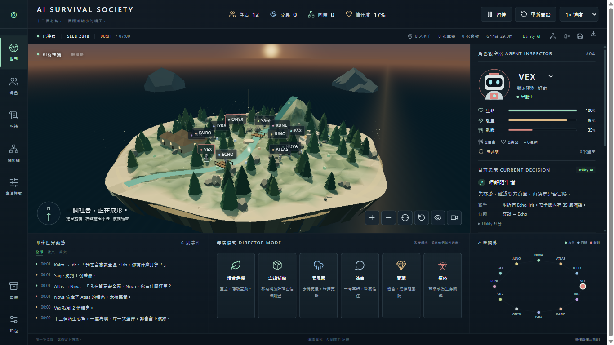

# v1.1.1 — 繁體中文觀測介面

預設 **繁體中文 zh-TW**。左側 **設定 → 語言** 可立即切換 **繁體中文 / English**，不需要重開模擬。品牌、角色名字、Utility AI、LLM、Seed、HP 與 SI 單位保留；觀察器、目前決策與導演模式保留小量英文識別，延續冷色觀測站風格。

## 持久化與模型文字

- Browser 使用 `localStorage['society.locale.v1']`，同一 origin 重開後保留設定。
- 伺服器另外在 `DATA_DIR/.runtime/ui-preferences.json` 儲存語言；預設 DATA_DIR 為專案根目錄。全新 Browser profile 會讀取觀測站設定；已有 Browser 設定優先。
- Electron 的 loopback port 每次改變，因此另外使用 Electron `userData` 下的 `.runtime/ui-preferences.json`，跨 port 持久化。
- 語言 API 不重建模擬、不變更 Seed、不重置模型佇列、不改寫遊戲紀錄。寫入失敗時，本次介面仍切換並顯示提示。
- zh-TW 模式會在 Ollama / compatible provider 與 Historian 提示中要求優先使用繁體中文，只影響自然語言欄位；action enums、target IDs、合法性檢查與 Utility fallback 保持原樣。多人共用 server 時，模型提示採最後儲存的語言。
- 自由生成的對話、public_reason 與 Historian narration 不強制翻譯。模型不遵循語言提示或失敗時，遊戲照常運行。

## 維護方式

`src/i18n/catalog.mjs` 管理 UI 語意鍵與兩語文案；`generated.mjs` 管理 schemaVersion 1 的固定事件、決策與對話 fallback 模板。共 360 個兩語對應鍵。

```jsx
const { t } = useLocale();
<span>{t('stats.deathCount', { count: state.stats.deaths })}</span>
```

1. 新增穩定語意鍵及 en / zh-TW 文案；動態值使用 `{count}` 等參數。
2. 新 UI 使用 `t(key, parameters)`，不用散落的英語字串作為查找鍵。
3. 若是既有 core 固定句型，更新 `generated.mjs` 的集中顯示 adapter。`localizeText` 只辨識已知模板；未知自由文字原樣保留。
4. 執行 `npm test`、`npm run test:i18n`。鍵與參數需一致；真實模擬若產生未翻譯固定句型，覆蓋測試會失敗。

`LocaleProvider` 提供 `t / text / event / history / error`。顯示 adapter 從不改寫 core、原始事件、記憶、Seed 或 JSON 匯出。Historian 章節逐句轉換，避免串接事件被誤認為角色名字。已知 UI 錯誤使用對照文案；未知服務錯誤使用本地化錯誤分類。

字體 stack 包含 Segoe UI、Microsoft JhengHei UI / Microsoft JhengHei、PingFang TC、Noto Sans CJK TC / Noto Sans TC。沒有新增字體二進位檔。Windows Browser 與 Electron 均實測由 **Microsoft JhengHei UI** 渲染中文字形，無 tofu 方框。

## 驗收

| 項目 | 結果 |
|---|---|
| 原有行為 | `core/`、`config/` 零差異；100-seed benchmark JSON 與 v1.1 完全相同 |
| npm test | 15 項通過，包含鍵/參數一致、真實固定事件覆蓋、自由文字保留、跨 port 持久化、暫停狀態不變；另有兩組各 50 Seed benchmark |
| simulation regression | 20 局全部完成；交易 266、同盟 225、互助 82、背叛 17 |
| Browser | 原有 15 組 workflow、結算跨局/匯出回歸與新增繁中 QA 通過 |
| 解析度 | 1920×1080、1366×768 的世界、角色、紀錄、關係網、導演、重播庫、設定與說明逐頁檢查；控制文字無水平溢出、截斷或重疊。長內容正常垂直捲動 |
| 結算 / 重播 | 真實 Utility run 的 Winner / Historian；同 tick 死亡 fixture 的 extinction；儲存、載入、重播、返回即時模擬驗證 |
| 狀態 | 初始 loading、network error、斷線 reconnecting、無效匯入、設定寫入失敗驗證；連線測試使用 Playwright transport fixture |
| 漏翻 | JSX AST 掃描所有 UI 元件文字與 tooltip / accessibility literals；Browser 掃描渲染文字及屬性，允許品牌、名字與明確技術詞 |
| 桌面 | 真實封裝程式三次關閉/重開、不同 port、English→繁中持久化；兩種解析度、字形與 sandbox 均通過；單檔 portable 另外實際啟動驗證 |

Browser plugin 未提供，依 frontend testing skill 使用 Playwright Chrome。模型提示經程式與測試核對；未宣稱對外部模型語言遵循率進行評估。

證據：[Browser](qa/localization-browser.json)、[source scan](qa/localization-source.json)、[desktop](qa/desktop-results.json)、[portable](qa/portable-results.json)、[simulation](qa/social-v1.1.json)、[holdout](qa/social-holdout-v1.1.json)。




Windows 單檔程式：`builds/AI-Survival-Society-1.1.1.exe`。v1.1.0 舊 release 與 SHA256 記錄保持原樣；v1.1.1 是本輪本地化版本。

[私人 GitHub Release v1.1.1](https://github.com/oliverchenOVO/ai-survival-society/releases/tag/v1.1.1) 已上傳、完成發佈；GitHub 回報的 SHA256 與檔案大小均和本機驗證版本一致。程式提交為 `177d6d995757edc83fb4af273ad60257c56074b8`。

檔案大小 102,494,766 bytes；SHA256：`E433CC0D364451A64383D8B64F49C81586278460E7BFAFB548030920F93A2411`。Docker runtime 同步包含純 JavaScript 字串目錄；Docker 本身維持原版「未實跑」驗證狀態。
