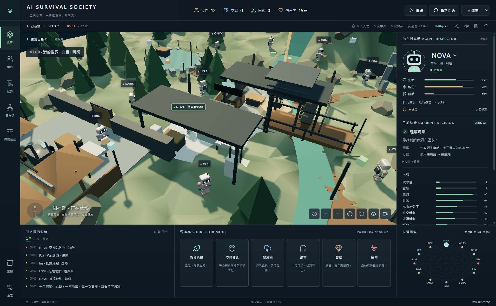
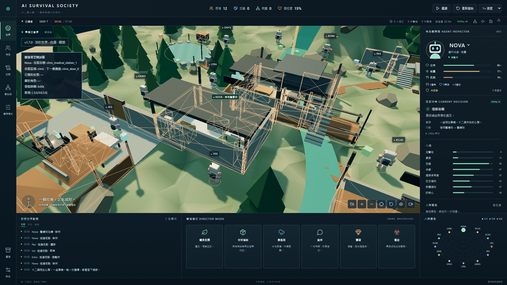

# 同場景：診所治療

同 Seed 7、起點 (-7, 6)、NOVA、25 HP、同醫療目標與鏡頭，門保持開啟。這是隔離的明確目標驗收 fixture，不會替正式模擬安排劇情。v1.6 使用實際已封裝的舊 engine／Electron renderer，非新版偽造舊路線。

| v1.6                                     | v1.7                                    |
| ---------------------------------------- | --------------------------------------- |
|  |  |
| 1.5s 完成治療；路線穿過診所西牆          | 4.75s 完成治療；走入口，抵達醫療位      |

自動驗證兩段實際軌跡與 clinic_side-1 相交：舊版為 true，新版為 false。完整座標與驗證方法在 [spatial-browser-v1.7.json](qa/spatial-browser-v1.7.json)。
